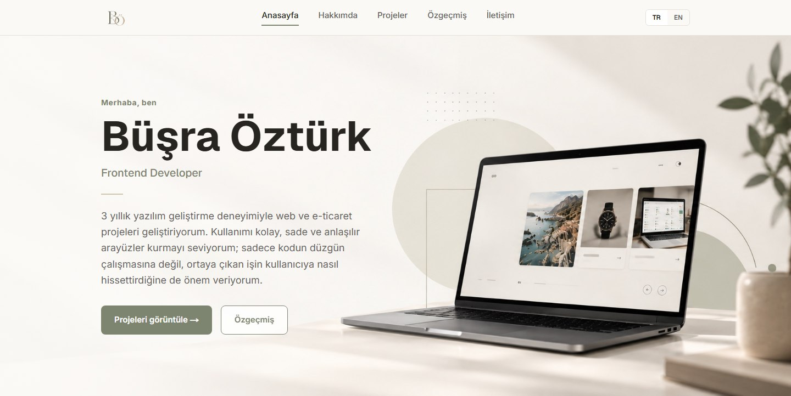

# Büşra Öztürk — Portfolyo

Frontend Developer olarak projelerimi, deneyimimi ve özgeçmişimi bir arada sunduğum kişisel portfolyo sitem. Türkçe ve İngilizce dil desteğiyle, statik olarak GitHub Pages üzerinde yayınlanıyor.

**Canlı site:** https://busraaozturk.github.io/busraozturk/



## Özellikler

- **Türkçe / İngilizce dil desteği:** Menüdeki TR / EN butonlarıyla tüm içerik anında değişir; seçim tarayıcıda hatırlanır.
- **Ana sayfa:** Tanıtım, hakkımda, öne çıkan proje, öğrenme sürecimde paylaştığım GitHub repoları, teknik beceriler ve iletişim bölümleri.
- **Özgeçmiş sayfası:** İş deneyimi, eğitim ve kullandığım araçlar; Türkçe ve İngilizce PDF olarak indirilebilir.
- **Responsive tasarım:** Mobilde sayfanın üzerinde açılan menü.
- **Erişilebilirlik:** Anlamlı HTML yapısı, klavye odak göstergeleri, ekran okuyucular için etiketler ve seçili dile göre güncellenen `lang` özniteliği.

## Teknolojiler

| Alan | Kullanılanlar |
|---|---|
| Framework | [Next.js 16](https://nextjs.org) (App Router, statik export) |
| Arayüz | React 19, TypeScript |
| Stil | Tailwind CSS 4 |
| Yazı tipleri | Geist, Inter, Caveat (`next/font`) |
| Yayın | GitHub Actions → GitHub Pages |

## Proje Yapısı

```
app/
  layout.tsx          Kök düzen, yazı tipleri ve sayfa başlığı
  page.tsx            Ana sayfa
  resume/page.tsx     Özgeçmiş sayfası
  globals.css         Renk paleti ve temel stiller
  icon.png            Favicon
components/           Sayfa bölümleri (hero, about, projects, skills, contact…)
lib/
  site.ts             Ad, iletişim bilgileri, logo ve PDF yolları
  language.ts         TR / EN dil seçimi
public/               Görseller ve özgeçmiş PDF'leri
```

## İçeriği Düzenleme

- **Metinler:** Her bileşen kendi Türkçe (`tr`) ve İngilizce (`en`) metinlerini dosyasının başında tutar. İngilizce metin eksik kalırsa TypeScript hata verir.
- **Kişisel bilgiler:** Ad, e-posta ve sosyal medya linkleri `lib/site.ts` içindedir.
- **Renkler:** Renk paleti `app/globals.css` içinde CSS değişkenleri olarak tanımlıdır.
- **Özgeçmiş PDF'leri:** `public/BusraOzturk-CV.pdf` (Türkçe) ve `public/BusraOzturk-CV-EN.pdf` (İngilizce).

## Yayınlama

`main` dalına yapılan her push, [`.github/workflows/deploy.yml`](.github/workflows/deploy.yml) ile siteyi derler ve GitHub Pages'e yayınlar.

## İletişim

- E-posta: [busrozturk13@gmail.com](mailto:busrozturk13@gmail.com)
- LinkedIn: [linkedin.com/in/busraoozturk](https://www.linkedin.com/in/busraoozturk)
- GitHub: [github.com/busraaozturk](https://github.com/busraaozturk)
